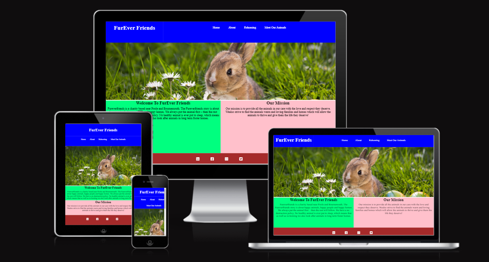

# Welcome To Furever Firends

[View Live Site](https://fureverfriendsms3.herokuapp.com/)

Welcome to Furever Friends! We are a charity based in the beautiful Dorset countryside, helping to care for and rehome our lovely animals!.
This charity was born out of neccessity as more and more people are having to give up their pets due to the ongoing cost of living crisis.
The primary aims of the site is to give users information on what we do as a charity. Our core values and beliefs and allows users to see pictures and information on the animals that we currently in our care.
If the user is particularly interested in a particular animal (or animals) they are also able to use our booking app to book a visit and meet our Furever Friends in person!

## Project Goals
### User Goals

* To have a fun and enjoyable experience whilst using the site
* To be able to navigate around the site easily without complications
* To be able to visit the site on different devices
* To be able to get information on the animals in our care
* To be able to book a visit to meet a particular animal (or animals)

### Site Owner Goals

* To rehome the animals in our care
* To provide the user with a fun and enjoyable experience
* To allow the user to access the site on any device they choose
* To give users a positive experience so that they return to the site
* To keep the site simple as the main goal of the site is to rehome the animals in our care, so the focus must be on showcasing our animals and encourage the user to book a visit to meet the animals.

## User Experience
### Target Audience

* People who love animals
* People wanting to rehome our animals
* People wanting to support and get involved with our charity

### Requirements and Expectations

* A fully functional and responsive website
* Clear and easy navigation between pages and sections of the website
* An asthetically please website
* To provide an enjoyable and informative experience which will encourage users to book a visit to meet one of our animals.
* Should be able to make a booking
* Should be able to view their booking
* Should be able to make changes to their booking
* Should be able to delete their booking
* Should have an interactive and enjoyable experience

## User Stories
### First Time User

* Should immediatley be able to understand how to use and navigate around the website
* Should arrive on the website and understand what we do as a charity
* Should be able to find information on the animals in our care
* Should be able to easily find the booking page and be able to book a visit to see one of our animals.
* Should be able to make a booking
* Should be able to view their booking
* Should be able to make changes to their booking
* Should be able to delete their booking
* Should have an interactive and enjoyable experience

### Returning Users

* Should be able to find updated information on the animals in our care
* Should have an interactive and enjoyable experience

### Site Owner
* Wants the user to know how to navigate through the website easily to find the information that they want
* Wants the user to feel at ease with using the site and ensure that there isn't a steep learning curve
* Wants the site to be accessible to anyone who wishes to use it
* Wants the user to be able to book a visit to meet one of our animals

## Wireframes
The wireframes below Where created at the beginnig of this project with a mobile first approach in mind. The aim was to keep the design as simple as possible so as not to take away from the experience that the game itself would provide. These wire frames where created with a software called [Just In Mind](https://www.justinmind.com/)

### Home Page
* [Mobile](https://github.com/Shaun-Finnegan/Fureverfriends-MS3/blob/main/fureverfriends/static/readme-images/home-mobile.png?raw=true)
* [Tablet](https://github.com/Shaun-Finnegan/Fureverfriends-MS3/blob/main/fureverfriends/static/readme-images/home-tablet.png?raw=true)
* [Desktop](https://github.com/Shaun-Finnegan/Fureverfriends-MS3/blob/main/fureverfriends/static/readme-images/main-desktop.png?raw=true)
### About Page
* [Mobile](https://github.com/Shaun-Finnegan/Fureverfriends-MS3/blob/main/fureverfriends/static/readme-images/about-mobile.png?raw=true)
* [Tablet](https://github.com/Shaun-Finnegan/Fureverfriends-MS3/blob/main/fureverfriends/static/readme-images/about-tablet.png?raw=true)
* [Desktop](https://github.com/Shaun-Finnegan/Fureverfriends-MS3/blob/main/fureverfriends/static/readme-images/about-desktop.png?raw=true)
### Rehoming Page
* [Mobile](https://github.com/Shaun-Finnegan/Fureverfriends-MS3/blob/main/fureverfriends/static/readme-images/rehoming-mobile.png?raw=true)
* [Tablet](https://github.com/Shaun-Finnegan/Fureverfriends-MS3/blob/main/fureverfriends/static/readme-images/rehoming-tablet.png?raw=true)
* [Desktop](https://github.com/Shaun-Finnegan/Fureverfriends-MS3/blob/main/fureverfriends/static/readme-images/rehoming-desktop.png?raw=true)
### Meet Our Animals Page
* [Mobile](https://github.com/Shaun-Finnegan/Fureverfriends-MS3/blob/main/fureverfriends/static/readme-images/booking-mobile.png?raw=true)
* [Tablet](https://github.com/Shaun-Finnegan/Fureverfriends-MS3/blob/main/fureverfriends/static/readme-images/booking-tablet.png?raw=true)
* [Desktop](https://github.com/Shaun-Finnegan/Fureverfriends-MS3/blob/main/fureverfriends/static/readme-images/booking-desktop.png?raw=true)

## Color Scheme
For this project bright and vibrant colors where used. The reason for this was to help put the user in a positive state of mind whilst using the site, which would allow them to develop a positive association to the site and the charity name.

## Structure
The structure of the website was kept as simple as possible. This would allow the user to easily navigate through the site and find the information that they are looking for.
The main focus of this site is to allow users to view and find information on the animals we are looking to rehome and then book a viewing to meet the animal that they are interested in.
So it was felt that the site should be kept as simple as possible to not distract from the main focus of the site.

## Features

### Navigation Bar and Logo
This allows the user to quickly and easily navigate through the site to find the information that they are looking for. The Logo also acts as a link and will return the user to the home page.

### Banner image
This is found under the navigation bar on each page of the website. Each banner image contains a picture of a different animal. This is done to encourage an emotive response from the user.

### Welcome To Furever Friends
This section welcomes the user to the site and gives them an insight into what the sight is about.

### Our Mission
This section tells the user what we are about as a charity and what we are trying to achieve.

### About Us
This section gives the user information on our formation, location and our history.

### Why We Do It
This section is used to show our passion for the work we do and hopefully this will inspre users to be as passionate about animals as we are!

### Rehoming
This section aims to inform the user what is meant by rehoming. It outlines the process we take to rehome one of our animals and what we expect of the people rehoming our Furever Friends!

### Fostering
This section gives the user information on fostering, how the user can help and the process we go through to ensure the decision to foster one of our Furever Friends is the right decision for both the animal and the the person fostering them.

### Meet Our Animals
This section gives the user the opportunity to find out more about the animals in our care.

### Book A Visit
If a user likes a particular animal they have read about on the website they are able to book a visit so they can spend time with the animal and get to know them better. The user will have to enter certain information about themselves
* First Name
* Last Name
* Email
and certain information about the animal.
* Animal type
* Animal Name

Once the form has been submitted one of our team will be in touch to arrange a suitable date and time for the visit.

### Viewing A Booking
Once the user has made a booking to meet the Furever Friend of their choosing they will be able to view their booking.

### Editing A Booking
Once the user has made a booking they will have the option to change the details of their booking such as choosing to visit a different animal.
The User can also delete or cancel their booking by using the Delete button under their booking.

### Footer and Social Links
At the bottom of each page the user will be able to interact with the footer menu that contains links to our social media pages.

## Technologies Used
* HTML
* CSS
* Python
* Flask
* Github
* Heroku
* SQLAlchemy
* PostgreSQL
* Jinja
* ElephantSQL

### Additional Tools Used For This Project

* Justinmind prototyping tool
* Chrome Developer Tools

## Testing

### Cross Platform Testing

Once the site was completed and deployed it was tested on four web browsers to check that the application behaved and performed the same way on each one. The browsers used where:

* Google Chrome
* Mozilla FireFox
* Microsoft Edge
* Safari

Overall I was pleased to see that the sites performancer and behaviour was consistent througfhout all four browsers.

### Compatability Testing

Once deployed the site was tested on numerous devices to ensure that performance and behaviour were consistent. The devices used are as follows:

* Asus VivoBook
* Ipad Air 3
* Samsung Galaxy s8
* OPPO A72
* Various templates within Chrome Dev Tools

Performance and behaviour of the application whilst being tested on these devices was consistent and the application behaved as intended on each device.

### Responsive Testing

As well as the application been tested on all the devices mentioned above, the application was also tested using the responsive screen view in chrome dev tools. This additional testing really helped to pick out any responsiveness issues that had previously been overlooked. However the application was very responsive and behaved the way the developer intended on all screen sizes.

## Validator Testing

### HTML
The tool I chose to use to validate my HTML was [W3C Markup Validator](https://validator.w3.org/) and I am delighted to say that there were no errors or major issues with my Markup. As you can see from below.

#### Home Page

#### About Page

#### Rehoming Page

#### Meet Our Animals Page

### Semantic HTML
As you can see from the above images there are a few warnings been shown by the validator.

I could resolve these warnings by replacing the semantic HTML with DIV tags. However I have decided that due to the website having a specific structure  It was important to leave the sementic elements within my markup.

This has had no effect on the perfomance or accessibility of the website.

### CSS

The validation service used for testing my CSS was the [W3C CSS Validation Service](https://jigsaw.w3.org/css-validator/) and I was delighted to see that there where no major issues or errors with my CSS file.

### Python
The service is used to validate the Python code for this project was The Code Institute's [Python Validation Service](https://pep8ci.herokuapp.com/).
I was delighted to see that apart from a few indentation errors there were no major issues with my code.

#### Run

#### Models

#### Routes

#### Init

## Performance and Accessibility Testing

To test the overall performance and accessibility of the application U used The Google Chrome Lighthouse Extension I tested both performance and accesibility on desktop and mobile devices and I was very pleased with the results.

### Desktop

### Mobile

